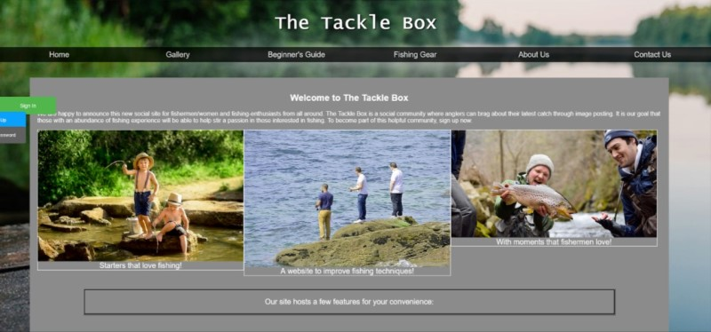

# The Tackle Box Documentation
## Purpose
The Tackle Box is a social fishing website utilizing ideas inspired by social media sites such as Pinterest. The specific goal of the website is to connect those with an interest in fishing no matter the experience level. Anglers view their catch as a trophy and are typically eager to share their stories regarding their favorite catches. There is currently no central hub for fishing hobbyists to meet socially and share their best catches. Individuals are able to create a unique account that allows them to post images of their favorite catches, developing a fun and competitive social network. 

As a means to help inspire the beginning user base, the website includes guides for fishing and fishing equipment. These resources are developed to ease one into fishing if they are interested but inexperienced. Further, the homepage will be designed to inform potential users of the purpose and description of the website.

User’s are able to create an account, log in, logout, and modify their password. A moderator account has the capability to delete an image post or ban a user that is abusing the site. Navigation is accomplished via a horizontal menu located under the page’s title and a sidebar. A database is implemented to store account data and image data related to each account. A contact form is implemented to allow users with questions, comments, or technical issues to contact the website administration and will send an email to the website’s support email, thetackleboxform@gmail.com. Lastly, an about us page is implemented to give inquisitive users a more detailed understanding of the website’s origins and purpose.

## Outcome

### Home Page
The home page shows a quick introduction and description of the site’s premise. The black navigation bar on top is available on every page and allows access to each of the following web pages: 

-	Home page
-	Gallery 
-	Beginner’s Guide
-	Fishing Gear
-	About Us
-	Contact Us

## Developers

This website was developed by Carlitos Carmona, David Falconer, Alex Garcia, Eric Levas, Victor Nguyen, Emanuel Ordonez, Yumi Park.

## Project Management 
Ensure that we follow git flow branching structure

We will be primarily pushing to feature branches, and consolidating on Develop.
Master will only be used for stable "release" versions.